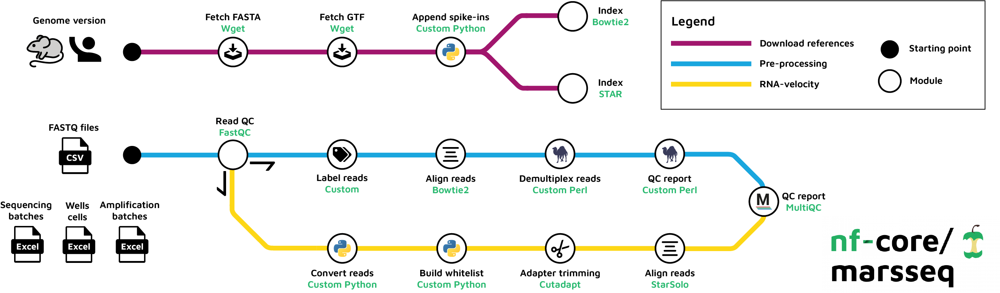

#  

[](https://nf-co.re/marsseq/results)[](https://doi.org/10.5281/zenodo.XXXXXXX)

[](https://www.nextflow.io/)
[](https://docs.conda.io/en/latest/)
[](https://www.docker.com/)
[](https://sylabs.io/docs/)
[](https://tower.nf/launch?pipeline=https://github.com/nf-core/marsseq)

[](https://nfcore.slack.com/channels/marsseq)[](https://twitter.com/nf_core)[](https://mstdn.science/@nf_core)[](https://www.youtube.com/c/nf-core)

## Introduction

**nf-core/marsseq** is a bioinformatics pipeline for MARS-seq v2.0 preprocessing pipeline. As an additional work we have developed custom set of scripts to run velocity inference using `StarSolo`.
We do so by converting the raw reads into 10X v2 format. For more information please have a look at the [Proks et al., XXX 2023](https://example.com).



## Usage

> **Note**
> If you are new to Nextflow and nf-core, please refer to [this page](https://nf-co.re/docs/usage/installation) on how
> to set-up Nextflow. Make sure to [test your setup](https://nf-co.re/docs/usage/introduction#how-to-run-a-pipeline)
> with `-profile test` before running the workflow on actual data.

To run the pipeline you have create experiment metadata files (`seq_batch.xls`, `wells_cells.xls`, `amp_batches.xls`) and samplesheet (`samplesheet.csv`). We provide test example [here](...).

You can download the Excel templates files [here](...).

Next, you have to generate genome references to incorporate ERCC spike-ins. References are downloaded from
[GENCODE](https://www.gencodegenes.org) database.

```bash
nextflow run nf-core/marsseq \
   --genome <mm10,mm9,GRCh38> \
   --build_references \
   --outdir references
```

Now, you can run the pipeline using:

```bash
nextflow run nf-core/marsseq \
   -profile <docker/singularity/.../institute> \
   --input samplesheet.csv \
   --outdir <OUTDIR>
```

> **Warning:**
> Please provide pipeline parameters via the CLI or Nextflow `-params-file` option. Custom config files including those
> provided by the `-c` Nextflow option can be used to provide any configuration _**except for parameters**_;
> see [docs](https://nf-co.re/usage/configuration#custom-configuration-files).

For more details, please refer to the [usage documentation](https://nf-co.re/marsseq/usage) and the [parameter documentation](https://nf-co.re/marsseq/parameters).

## Pipeline output

To see the the results of a test run with a full size dataset refer to the [results](https://nf-co.re/marsseq/results) tab on the nf-core website pipeline page.
For more details about the output files and reports, please refer to the
[output documentation](https://nf-co.re/marsseq/output).

## Credits

nf-core/marsseq was originally written by [Martin Proks](https://github.com/matq007).

We thank the following people for their extensive assistance in the development of this pipeline:

* Jose Alejandro Romero Herrera ([@joseale2310](https://github.com/joseale2310))
* Maxime Garcia ([@maxulysse](https://github.com/maxulysse))

Keren-Shaul, H., Kenigsberg, E., Jaitin, D.A. et al. MARS-seq2.0: an experimental and analytical pipeline for indexed sorting combined with single-cell RNA sequencing. Nat Protoc 14, 1841–1862 (2019). https://doi.org/10.1038/s41596-019-0164-4

## Contributions and Support

If you would like to contribute to this pipeline, please see the [contributing guidelines](.github/CONTRIBUTING.md).

For further information or help, don't hesitate to get in touch on the [Slack `#marsseq` channel](https://nfcore.slack.com/channels/marsseq) (you can join with [this invite](https://nf-co.re/join/slack)).

## Citations

<!-- TODO nf-core: Add citation for pipeline after first release. Uncomment lines below and update Zenodo doi and badge at the top of this file. -->
<!-- If you use  nf-core/marsseq for your analysis, please cite it using the following doi: [10.5281/zenodo.XXXXXX](https://doi.org/10.5281/zenodo.XXXXXX) -->

<!-- TODO nf-core: Add bibliography of tools and data used in your pipeline -->

An extensive list of references for the tools used by the pipeline can be found in the [`CITATIONS.md`](CITATIONS.md) file.

You can cite the `nf-core` publication as follows:

> **The nf-core framework for community-curated bioinformatics pipelines.**
>
> Philip Ewels, Alexander Peltzer, Sven Fillinger, Harshil Patel, Johannes Alneberg, Andreas Wilm, Maxime Ulysse Garcia, Paolo Di Tommaso & Sven Nahnsen.
>
> _Nat Biotechnol._ 2020 Feb 13. doi: [10.1038/s41587-020-0439-x](https://dx.doi.org/10.1038/s41587-020-0439-x).
